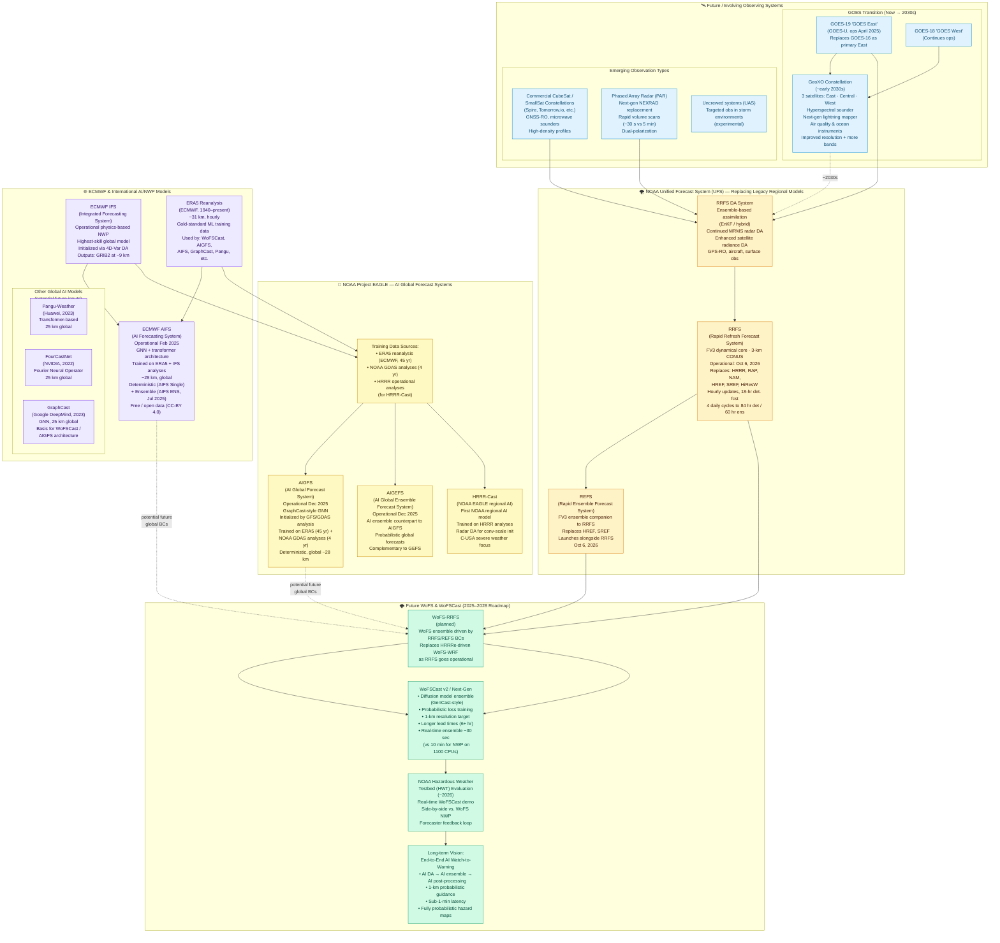

```mermaid
flowchart TD

  %% ══════════════════════════════════════════════════════════
  %% PHYSICAL SENSORS & GROUND TRUTH
  %% ══════════════════════════════════════════════════════════
  subgraph SENSORS["🔬  Physical Sensors & Observing Platforms"]
    direction TB

    subgraph RADAR_SRC["Radar Infrastructure"]
      RDA["WSR-88D / NEXRAD\nRDA Unit (160 sites)\nLevel-II: Reflectivity,\nRadial Velocity,\nSpectrum Width,\nDual-pol (ZDR, ρHV, ΦDP)"]
    end

    subgraph SAT_SRC["Satellite Instruments"]
      ABI["GOES-16 / GOES-18\nABI Instrument\n16 spectral bands\n(vis, NIR, IR)\nLevel-0 raw telemetry"]
      GLM["GOES-16 / GOES-18\nGLM (Geostationary\nLightning Mapper)"]
      POES["Polar-Orbiting Satellites\n(NOAA, MetOp, SNPP, JPSS)\nMicrowave sounders\n(AMSU-A, MHS, ATMS)\nHyperspectral IR\n(CrIS, IASI)"]
      GNSS["GNSS / GPS-RO\n(COSMIC-2, Spire)\nAtmospheric refractivity\ntemperature & moisture"]
      SCAT["Scatterometers\n(ASCAT, RapidScat)\nOcean surface winds"]
    end

    subgraph INSITU["In-Situ Networks"]
      RAOB["Radiosonde Network\n(rawinsonde balloons)\nT, Td, wind, p profiles\n~900 global sites\n00Z / 12Z launches"]
      METAR["ASOS / AWOS / METAR\nSurface stations\nT, Td, wind, p, wx"]
      MESO["Oklahoma & Nat'l Mesonet\nHigh-density surface obs\n(5-min interval)"]
      ACARS["Aircraft PIREPS / ACARS\nAMDAR reports\nT, wind along flight tracks"]
      PROF["Wind Profilers\n(NOAA Profiler Network)\nVertical wind profiles"]
      BUOY["Buoys & Ships\nSST, marine surface obs"]
      GAUGE["Rain Gauges\n(COOP, CoCoRaHS)\nGround-truth QPE"]
      LIGHTNING["Lightning Networks\n(NLDN, ENI)\nCloud-to-ground &\nin-cloud stroke data"]
    end
  end

  %% ══════════════════════════════════════════════════════════
  %% LEVEL-II / RAW DATA PROCESSING
  %% ══════════════════════════════════════════════════════════
  subgraph RAW_PROC["⚙️  Raw Data Processing & Level-1 Products"]
    direction LR
    RPG["WSR-88D RPG\n(Radar Product Generator)\nLevel-II → Level-III\nproducts (composite\nreflectivity, VIL, echo tops)"]
    L1B["GOES L1b Processing\n(NOAA/NESDIS)\nCalibrate & geolocate\nABI radiances\n(NetCDF, ~5-min refresh)"]
    L2GOES["GOES L2 Products\n(NOAA STAR algorithms)\nCloud Mask, CWP, CTH,\nClear-sky radiances,\nDerived stability indices"]
    BUFR["Conventional Obs\nQC & Formatting\n(PrepBUFR via NCEP)\nMETARs, RAOBs,\nACDARS → BUFR format"]
  end

  %% ══════════════════════════════════════════════════════════
  %% MRMS
  %% ══════════════════════════════════════════════════════════
  subgraph MRMS_SYS["🗺️  MRMS — Multi-Radar Multi-Sensor System"]
    MRMS["MRMS Processing\n(NSSL / NCEP)\nFuses 160 WSR-88D radars\n+ gauges + satellite + models\n→ Seamless national mosaics:\n  • Composite reflectivity\n  • Dual-pol QPE\n  • Rotation tracks\n  • PrecipType, PrecipRate"]
  end

  %% ══════════════════════════════════════════════════════════
  %% GLOBAL MODELS
  %% ══════════════════════════════════════════════════════════
  subgraph GLOBAL_MODELS["🌍  Global Forecast System (GFS / FV3-GFS)"]
    direction TB
    GDAS["GDAS\n(Global Data Assimilation System)\nGSI + Hybrid 4DEnVar\n6-hourly cycle"]
    GFS_MDL["GFS / FV3-GFS Forecast\n~13 km global\n0-384 hr forecasts\nGRIB2 output"]
    GEFS_MDL["GEFS\n(30-member ensemble)\nEnsemble spread from\nGFS-based perturbations\n~25 km global"]
    GDAS --> GFS_MDL
    GFS_MDL --> GEFS_MDL
  end

  %% ══════════════════════════════════════════════════════════
  %% RAP / HRRR
  %% ══════════════════════════════════════════════════════════
  subgraph RAP_HRRR["🌪️  RAP & HRRR (NOAA/ESRL/EMC)"]
    direction TB
    RAP_DA["RAP Data Assimilation\nGSI Hybrid 3DEnVar\n13-km grid\nHourly update cycle\nIngest: conventional,\nradar, sat radiances,\nGPS-RO, profilers"]
    RAP_MDL["RAP Forecast\n13-km, 50 levels\n0-51 hr forecasts\nHourly updates"]
    HRRR_DA["HRRR Data Assimilation\nGSI Hybrid EnVar\n3-km grid\nHourly cycle\n(15-min radar DA sub-cycle)\nIngest: MRMS radar,\nGOES radiances, surface,\nradar reflectivity nudging"]
    HRRR_MDL["HRRR Forecast\n3-km, WRF-ARW core\n0-48 hr forecasts\nHourly updates"]
    HRRRE_MDL["HRRRe\n(HRRR-Ensemble)\n3-km, 6 members\nInitial & lateral BCs\nfor WoFS-WRF"]
    RAP_DA --> RAP_MDL
    RAP_MDL --> HRRR_DA
    HRRR_DA --> HRRR_MDL
    HRRR_MDL --> HRRRE_MDL
  end

  %% ══════════════════════════════════════════════════════════
  %% STATIC / ANCILLARY DATA
  %% ══════════════════════════════════════════════════════════
  subgraph STATIC["🗄️  Static & Ancillary Datasets"]
    direction LR
    TERRAIN["Terrain / Topography\nGTOPO30 / GMTED2010\nSRTM 30-arc-sec DEM"]
    LANDUSE["Land Use / Land Cover\nMODIS / USGS / NLCD"]
    SOIL["Soil Type & Vegetation\nFAO / STATSGO / MODIS"]
    SST["Sea Surface Temperature\nRTG-SST (daily)\nGHRSST / OI-SST"]
    OZONE["Ozone Climatology\nfor satellite DA"]
  end

  %% ══════════════════════════════════════════════════════════
  %% WPS / WRF Pre-processing
  %% ══════════════════════════════════════════════════════════
  subgraph WPS["🔧  WRF Pre-processing System (WPS)"]
    direction TB
    GEOGRID["geogrid\nInterpolate static fields\n(terrain, land use, soil)\nonto WRF domain"]
    UNGRIB["ungrib\nDecode GRIB2 met fields\n(GFS/HRRRe ICs & BCs)"]
    METGRID["metgrid\nHorizontally interpolate\nmet fields onto WRF grid"]
    GEOGRID --> METGRID
    UNGRIB  --> METGRID
  end

  %% ══════════════════════════════════════════════════════════
  %% WoFS-WRF
  %% ══════════════════════════════════════════════════════════
  subgraph WOFSWRF["🌩️  WoFS-WRF System  (WRF-ARW · 3 km · 36 members)"]
    direction TB
    DA_WRF["WoFS-WRF Data Assimilation\nGSI-based EnKF\n15-min rapid-update cycle\nAssimilates:\n  • MRMS reflectivity & velocity\n  • GOES L2 CWP & radiances\n  • PrepBUFR conventional obs\n  • Mesonet surface obs"]
    WRF_ENS["WRF-ARW Ensemble\n36 members · 3-km grid\n~900×900 km domain\nPhysics perturbations\nStochastic params"]
    WRFOUT["WRFOUT netCDF\n3-D atmospheric state\nevery 5 min\n(~50 variables, multiple levels)"]
    DA_WRF --> WRF_ENS --> WRFOUT
  end

  %% ══════════════════════════════════════════════════════════
  %% MPAS Pre-processing
  %% ══════════════════════════════════════════════════════════
  subgraph MPAS_PREP["🔧  MPAS Pre-processing"]
    direction TB
    MPAS_INIT["mpas_init / init_atmosphere\nConvert GFS/GEFS fields\nto MPAS unstructured mesh\n(Voronoi, variable resolution)"]
    MPAS_LBC["MPAS LBC Processor\nLateral boundary conditions\nfrom GFS or GEFS members\n(updated every 3 hr)"]
    MPAS_STATIC["MPAS Static Fields\n(terrain, land use, soil,\nvegetation on Voronoi mesh)"]
  end

  %% ══════════════════════════════════════════════════════════
  %% WoFS-MPAS
  %% ══════════════════════════════════════════════════════════
  subgraph WOFSMPAS["🌐  WoFS-MPAS System  (MPAS · 3 km · 36 members)"]
    direction TB

    subgraph MPAS_DA_OPT["DA Framework Options"]
      direction LR
      DART_DA["DART / EAKF\n(Primary — Ensemble\nAdjustment Kalman Filter)\nNCAR DART framework\n15-min update cycle"]
      JEDI_DA["JEDI / MPAS-JEDI\n(Experimental)\nJCSDA framework\nFV3/MPAS-coupled\n4DEnVar / EDA\nIODA obs format\nSupports all-sky\nradiance assimilation"]
    end

    MPAS_OBS["Observations assimilated:\n  • MRMS radar refl & radvel\n  • GOES L1b / L2 CWP\n  • PrepBUFR conventional\n  • Mesonet surface obs\n  • GNSS-RO refractivity\n  • Microwave sounder radiances\n    (via JEDI/CRTM)"]

    MPAS_ENS["MPAS Ensemble\n36 members · 3-km mesh\nUnstructured Voronoi grid\nPhysics perturbations\nStochastic params"]
    MPASOUT["MPAS output netCDF\n3-D atmospheric state\nevery 5 min"]

    DART_DA --> MPAS_ENS
    JEDI_DA -.->|experimental path| MPAS_ENS
    MPAS_OBS --> DART_DA
    MPAS_OBS --> JEDI_DA
    MPAS_ENS --> MPASOUT
  end

  %% ══════════════════════════════════════════════════════════
  %% WoFSCast TRAINING
  %% ══════════════════════════════════════════════════════════
  subgraph TRAIN["📚  WoFSCast Training Pipeline  (offline / historical)"]
    direction TB
    ARCH_WRF["Historical WoFS-WRF\nWRFOUT archive\n(multi-season, event days)"]
    ARCH_MPAS["Historical WoFS-MPAS\nMPAS output archive\n(experimental/future —\nnot current WoFSCast input)"]
    PRE["Shared Preprocessing Stack\n  • Select variables & vert levels\n  • Regrid to icosahedral mesh\n  • Normalize / standardize fields\n  • Build input→target time pairs\n  • Construct graph edge weights"]
    DS["ML-ready Dataset\n(input / target tensor pairs)\nStored as TFRecords / zarr"]
    MODEL["WoFSCast GNN Model\nGraphCast-style architecture\nEncoder–Processor–Decoder\nMessage-passing GNN\n— trained weights stored —"]
    ARCH_WRF  --> PRE
    ARCH_MPAS --> PRE
    PRE --> DS --> MODEL
  end

  %% ══════════════════════════════════════════════════════════
  %% WoFSCast REAL-TIME INFERENCE
  %% ══════════════════════════════════════════════════════════
  subgraph RT["⚡  WoFSCast Real-Time Inference Pipeline"]
    direction TB
    RT_PRE["Real-Time Preprocessing\n(identical pipeline to training)\nLatest WoFS-WRF analysis\n(current; WoFS-MPAS: future/planned)"]
    INFER["WoFSCast Inference\nGNN forward pass\nauto-regressive rollout\n(GPU accelerated)"]
    FCST["WoFSCast Forecast Output\nProbabilistic storm-scale fields\n5-min steps → 3+ hr lead times\nMultiple ensemble members"]
    PROD["Forecast Products\n  • Tornado probability\n  • Hail / wind swath probs\n  • Storm motion vectors\n  • UH / rotation tracks\n→ NWS · Emergency Mgmt · Public"]
    RT_PRE --> INFER --> FCST --> PROD
  end

  %% ══════════════════════════════════════════════════════════
  %% EDGES — physical sensors → raw processing
  %% ══════════════════════════════════════════════════════════
  RDA    --> RPG
  RDA    --> MRMS
  RPG    --> MRMS
  GAUGE  --> MRMS
  METAR  --> MRMS

  ABI    --> L1B
  L1B    --> L2GOES
  GLM    --> MRMS

  RAOB   --> BUFR
  METAR  --> BUFR
  ACARS  --> BUFR
  PROF   --> BUFR
  BUOY   --> BUFR
  MESO   --> BUFR

  POES   --> BUFR
  GNSS   --> BUFR
  SCAT   --> BUFR

  %% ══════════════════════════════════════════════════════════
  %% EDGES — obs into GDAS / GFS
  %% ══════════════════════════════════════════════════════════
  BUFR   --> GDAS
  L1B    --> GDAS
  L2GOES --> GDAS
  GNSS   --> GDAS
  SCAT   --> GDAS
  OZONE  --> GDAS

  %% ══════════════════════════════════════════════════════════
  %% EDGES — obs into RAP / HRRR DA
  %% ══════════════════════════════════════════════════════════
  BUFR   --> RAP_DA
  MRMS   --> RAP_DA
  L1B    --> RAP_DA
  L2GOES --> RAP_DA
  BUFR   --> HRRR_DA
  MRMS   --> HRRR_DA
  L1B    --> HRRR_DA
  L2GOES --> HRRR_DA

  %% GFS feeds RAP/HRRR boundary conditions
  GFS_MDL --> RAP_DA
  RAP_MDL --> HRRR_DA

  %% ══════════════════════════════════════════════════════════
  %% EDGES — static data into WPS / MPAS prep
  %% ══════════════════════════════════════════════════════════
  TERRAIN  --> GEOGRID
  LANDUSE  --> GEOGRID
  SOIL     --> GEOGRID
  SST      --> UNGRIB
  HRRRE_MDL --> UNGRIB
  TERRAIN  --> MPAS_STATIC
  LANDUSE  --> MPAS_STATIC
  SOIL     --> MPAS_STATIC
  SST      --> MPAS_INIT
  GFS_MDL  --> MPAS_INIT
  GEFS_MDL --> MPAS_LBC
  HRRR_MDL --> MPAS_INIT

  %% WPS → WoFS-WRF
  METGRID --> DA_WRF

  %% MPAS prep → WoFS-MPAS
  MPAS_INIT   --> MPAS_ENS
  MPAS_LBC    --> MPAS_ENS
  MPAS_STATIC --> MPAS_ENS

  %% ══════════════════════════════════════════════════════════
  %% EDGES — obs into WoFS DA systems
  %% ══════════════════════════════════════════════════════════
  MRMS   --> DA_WRF
  L2GOES --> DA_WRF
  BUFR   --> DA_WRF
  MESO   --> DA_WRF

  MRMS   --> MPAS_OBS
  L1B    --> MPAS_OBS
  L2GOES --> MPAS_OBS
  BUFR   --> MPAS_OBS
  MESO   --> MPAS_OBS

  %% ══════════════════════════════════════════════════════════
  %% EDGES — WoFS outputs → WoFSCast
  %% ══════════════════════════════════════════════════════════
  WRFOUT  --> ARCH_WRF
  MPASOUT -.->|future/exp| ARCH_MPAS
  WRFOUT  --> RT_PRE
  MPASOUT -.->|future/exp| RT_PRE

  MODEL -.->|"pre-trained weights"| INFER
  LIGHTNING --> MRMS

  %% ══════════════════════════════════════════════════════════
  %% STYLES
  %% ══════════════════════════════════════════════════════════
  classDef sensor    fill:#e0f2fe,stroke:#0284c7,color:#0c4a6e
  classDef rawproc   fill:#f1f5f9,stroke:#64748b,color:#1e293b
  classDef mrms      fill:#ede9fe,stroke:#7c3aed,color:#2e1065
  classDef global    fill:#fef9c3,stroke:#ca8a04,color:#3b2a00
  classDef raphrrr   fill:#fef3c7,stroke:#d97706,color:#451a03
  classDef staticdat fill:#f0fdf4,stroke:#16a34a,color:#14532d
  classDef wps       fill:#ecfdf5,stroke:#059669,color:#064e3b
  classDef wofswrf   fill:#d1fae5,stroke:#059669,color:#064e3b
  classDef wofsmpas  fill:#dcfce7,stroke:#16a34a,color:#14532d
  classDef train     fill:#fce7f3,stroke:#db2777,color:#500724
  classDef rt        fill:#ffedd5,stroke:#ea580c,color:#431407

  class RDA,ABI,GLM,POES,GNSS,SCAT,RAOB,METAR,MESO,ACARS,PROF,BUOY,GAUGE,LIGHTNING sensor
  class RPG,L1B,L2GOES,BUFR rawproc
  class MRMS,MRMS_SYS mrms
  class GDAS,GFS_MDL,GEFS_MDL global
  class RAP_DA,RAP_MDL,HRRR_DA,HRRR_MDL,HRRRE_MDL raphrrr
  class TERRAIN,LANDUSE,SOIL,SST,OZONE staticdat
  class GEOGRID,UNGRIB,METGRID wps
  class MPAS_INIT,MPAS_LBC,MPAS_STATIC wps
  class DA_WRF,WRF_ENS,WRFOUT,ARCH_WRF wofswrf
  class DART_DA,JEDI_DA,MPAS_OBS,MPAS_ENS,MPASOUT,ARCH_MPAS wofsmpas
  class PRE,DS,MODEL train
  class RT_PRE,INFER,FCST,PROD rt
```

# WoFSCast & WoFS-MPAS — Full Data Pipeline Map

This diagram traces every data source from the most upstream physical observations
all the way through to WoFSCast forecast products, including WoFS-WRF and WoFS-MPAS
and all their upstream model dependencies.

---

---

## Pipeline Reference Tables

### Physical Sensors

| Sensor / Network | Platform | Key Variables | Format | Update Rate |
|-----------------|----------|--------------|--------|-------------|
| WSR-88D (NEXRAD) | 160 ground sites | Z, Vr, ZDR, ρHV, ΦDP | Level-II (NEXRAD) | ~5 min per volume |
| GOES-16/18 ABI | GEO orbit | 16-band radiances | L0→L1b NetCDF | 30 s–5 min (CONUS) |
| GOES-16/18 GLM | GEO orbit | Lightning flash/group/event | L2 NetCDF | 20 s |
| NOAA/MetOp sounders | LEO polar | Microwave T & q profiles | BUFR | ~12 hr revisit |
| COSMIC-2 / Spire | LEO | GNSS-RO refractivity | BUFR | Continuous |
| ASCAT | MetOp | Ocean surface winds | BUFR | ~12 hr |
| Radiosonde | ~900 global sites | T, Td, u, v, p profiles | BUFR | 00Z/12Z |
| ASOS / METAR | ~1000 US sites | T, Td, wind, p, wx | BUFR / PrepBUFR | Hourly+ |
| Oklahoma Mesonet | 120 OK sites | High-density surface | ASCII / NetCDF | 5 min |
| ACARS / AMDAR | Commercial aircraft | T, wind aloft | BUFR | Continuous |
| Wind Profilers | ~35 NOAA sites | Vertical wind profiles | BUFR | Hourly |
| Rain Gauges | COOP, CoCoRaHS | Precip accumulation | ASCII | Hourly–daily |

### Global Models

| Model | Core | DA Method | Resolution | Output |
|-------|------|-----------|-----------|--------|
| GFS / FV3-GFS | FV3 (Finite-Volume Cubed-Sphere) | GSI Hybrid 4DEnVar (GDAS) | ~13 km | GRIB2, 6-hourly |
| GEFS | FV3 | Ensemble KF perturbations | ~25 km, 30 members | GRIB2 |
| ECMWF IFS | Spectral (T-L 1279, SH L137) | 4D-Var | ~9 km | GRIB2, 6-hourly |
| ECMWF AIFS | Neural network (transformer) | Learned from analysis | ~25 km | GRIB2 / zarr |
| NOAA AIGFS | Neural network (EAGLE program) | Learned from GFS/ERA5 | ~13–25 km | GRIB2 |
| NAVGEM | Spectral / semi-Lagrangian | 4D-Var hybrid EnVar | ~37 km | GRIB2 |
| ICON | Icosahedral-hexagonal (finite vol.) | KENDA / 3D-Var hybrid | ~13 km | GRIB2 |
| GEM (CMC) | Semi-Lagrangian spectral | EnKF + 4D-EnVar | ~15 km | GRIB2 |

### Mesoscale Models (RAP / HRRR)

| Model | Core | DA Method | Resolution | BCs From |
|-------|------|-----------|-----------|---------|
| RAP | WRF-ARW (Arakawa C, terrain-following) | GSI Hybrid 3DEnVar | 13 km | GFS |
| HRRR | WRF-ARW | GSI Hybrid EnVar + radar nudging | 3 km | RAP |
| HRRRe | WRF-ARW | Ensemble perturbations | 3 km, 6 members | HRRR |
| NAM | WRF-NMM (Nonhydrostatic Mesoscale Model) | GSI 3DVar | 12 km | GFS |

### RRFS (Operational 2026+)

| Model | Core | DA Method | Resolution | Replaces |
|-------|------|-----------|-----------|---------|
| RRFSv1 (det.) | FV3 (same as GFS) | GSI Hybrid EnVar + radar DA | 3 km, N. America | HRRR, RAP, NAM, HiResW |
| REFS (ens.) | FV3 | Ensemble perturbations | 3 km, ≥9 members | HRRRe, HREF, SREF |
| RRFSv2 (planned) | MPAS (Voronoi unstructured) | JEDI (planned) | 3 km+ variable | Succeeds RRFSv1 |

### WoFS Systems

| Aspect | WoFS-WRF | WoFS-MPAS |
|--------|----------|-----------|
| Dynamical core | WRF-ARW (Arakawa C, terrain-following η) | MPAS (unstructured Voronoi; Arakawa C on hexagons) |
| DA framework | GSI-based EnKF | DART/EAKF (primary); JEDI/MPAS-JEDI (experimental) |
| BCs | HRRRe → RRFSv1/REFS (2026) | GFS + GEFS (primary); RRFSv1/REFS (experimental, ~2026+) |
| Radar DA | MRMS reflectivity + radial velocity | MRMS reflectivity + radial velocity |
| Satellite DA | GOES L2 CWP, clear-sky radiances | GOES L1b radiances, L2 CWP; microwave sounders (via JEDI) |
| Grid | Structured 3-km | Unstructured 3-km mesh |
| Members | 36 | 36 |
| Output | WRFOUT netCDF | MPAS netCDF |
| Update cycle | 15 min | 15 min |

### WoFSCast ML System

| Stage | Description |
|-------|-------------|
| Training input | WoFS-WRF WRFOUT archives (current); WoFS-MPAS output archives (experimental/future) |
| Preprocessing | Variable selection, vertical level reduction, icosahedral regridding, normalization, graph mesh construction |
| Architecture | GraphCast-style GNN (Encoder–Processor–Decoder, message-passing) |
| Inference input | Latest WoFS-WRF analysis (current); WoFS-MPAS analysis (future/planned — no current operational link) |
| Output | Probabilistic storm-scale fields, 5-min steps, up to 3+ hr lead time |
| Products | Tornado / hail / wind probabilities → NWS, Emergency Management |

### WoFSCast-MPAS Parallel Pipeline (Future/Planned)

**WoFSCast currently only depends on WoFS-WRF.** WoFS-MPAS has no current operational
connection to WoFSCast. A parallel "WoFSCast-MPAS" pipeline is planned/experimental and
represented by four future nodes in the graph:

| Node | Name | Level | Role |
|------|------|-------|------|
| `TRAIN_PIPE_MPAS` | WoFSCast-MPAS Training Pipeline | 12 | Offline training using WoFS-MPAS archives and ERA5; parallel to the current WRF-based training pipeline |
| `GNN_MPAS` | WoFSCast-MPAS GNN Model | 13 | Separate GNN model trained on MPAS-format data; analogous to the current WoFSCast GNN but for the MPAS dycore |
| `INFERENCE_MPAS` | WoFSCast-MPAS Real-Time Inference | 14 | Real-time inference driven by WoFS-MPAS analysis; planned future path once MPAS pipeline matures |
| `PRODUCTS_MPAS` | WoFSCast-MPAS Forecast Products | 15 | Storm-scale probabilistic products from the MPAS-based AI pipeline |

All four nodes and their connecting edges are dashed/future in the graph. The planned
future edges are: `WoFSMPAS_ENS → TRAIN_PIPE_MPAS`, `ERA5 → TRAIN_PIPE_MPAS`,
`TRAIN_PIPE_MPAS → GNN_MPAS`, `WoFSMPAS_ENS → INFERENCE_MPAS`,
`GNN_MPAS → INFERENCE_MPAS`, and `INFERENCE_MPAS → PRODUCTS_MPAS`.

### JEDI vs. DART for WoFS-MPAS DA

| Feature | DART / EAKF | JEDI / MPAS-JEDI |
|---------|-------------|-----------------|
| Status | Primary / operational-class | Experimental |
| Framework | NCAR DART | JCSDA JEDI |
| Ensemble method | EAKF | 4DEnVar / EDA |
| Observation format | Custom DART obs | IODA (NetCDF) |
| Satellite radiances | Limited | Full all-sky treatment via CRTM |
| Microwave sounders | Limited | AMSU-A, MHS, ATMS |
| GNSS-RO | Limited | Supported |

---

## Dynamical Cores Reference

A **dynamical core** (dycore) is the part of an NWP model that solves the fluid dynamics equations — the Euler/Navier-Stokes equations governing atmospheric motion. The choice of dycore determines grid geometry, numerical scheme, conservation properties, scalability, and ultimately what kinds of physics and DA can be coupled. Every model in the WoFSCast chain uses one of a small set of dycores.

### Core Types in the WoFSCast Chain

| Dynamical Core | Type | Grid | Used In | Key Traits |
|----------------|------|------|---------|-----------|
| **WRF-ARW** (Advanced Research WRF) | Non-hydrostatic, finite-difference | Structured Arakawa-C; terrain-following η coordinate | RAP, HRRR, HRRRe, WoFS-WRF | Established convection-allowing workhorse; broad physics library; easy nesting; retiring from ops chain 2026 |
| **WRF-NMM** (Nonhydrostatic Mesoscale Model) | Non-hydrostatic, finite-difference | Rotated lat/lon E-grid | NAM | WRF framework but NMM solver; less community usage than ARW |
| **FV3** (Finite-Volume Cubed-Sphere) | Non-hydrostatic, finite-volume | Cubed-sphere (6 faces), Lagrangian vertical | GFS, GEFS, RRFSv1, REFS, HAFS | NOAA's Unified Forecast System (UFS) standard; excellent global scalability; same core at all scales from global to storm |
| **MPAS** (Model for Prediction Across Scales) | Non-hydrostatic, finite-volume | Unstructured Voronoi (hexagonal) C-grid | WoFS-MPAS, RRFSv2 (planned) | Variable-resolution: global mesh with local high-res refinement; eliminates lateral boundary artifacts; NOAA's long-term regional target |
| **Spectral / Semi-Lagrangian** | Hydrostatic (global) or NH (LAM) | Spherical harmonics + Gaussian grid | ECMWF IFS, NAVGEM, GEM (CMC), legacy GFS | Very high accuracy at large scales; expensive at convection-allowing resolution; being replaced by FV or FV3 at most centers |
| **Icosahedral finite-volume / finite-diff** | Non-hydrostatic | Triangular or hexagonal icosahedron | ICON (DWD), NICAM | Uniform global coverage; strong conservation; used in global ensemble products; potential future ML training data source |
| **Neural network / data-driven** | N/A (learned) | Reduced Gaussian or lat/lon learned grid | ECMWF AIFS, NOAA AIGFS, GraphCast, Pangu, FourCastNet | No explicit PDE solver; state-to-state learned mapping; training-data quality determines physics fidelity |

### Per-Model Dycore Details

#### WRF-ARW
WRF-ARW uses a staggered Arakawa-C grid on a terrain-following σ-η vertical coordinate and a time-split integration scheme (Klemp–Wilhelmson) with acoustic modes handled separately from slow meteorological modes. Its advantages for storm-scale work are a large and well-tested physics library (microphysics, PBL, cumulus, land surface, radiation) and the ability to run one-way and two-way nested grids. The WRF model framework was designed to be community-shareable, which is why both RAP/HRRR (NOAA ops) and WoFS-WRF (NSSL research/ops) run ARW. Its primary limitation is that the structured Cartesian grid requires explicit lateral boundary coupling, which introduces artifacts in convection-allowing nesting.

**Alternative ARW configurations considered for WoFS:**
- WRF-ARW with 3DVar (simpler but less effective than EnKF)
- WRF-ARW with LETKF (Local Ensemble Transform Kalman Filter) — tested at some centers
- WRF-DA + WRFPLUS (adjoint-based 4D-Var) — computationally expensive, not used operationally at convective scale

#### FV3 (UFS)
FV3 was developed at GFDL and adopted by NOAA as the UFS standard dycore in 2019. It uses a finite-volume discretization on a cubed-sphere grid (6 equal-area faces), with a Lagrangian vertical coordinate that remap-to-Eulerian each time step. This gives it excellent mass and energy conservation, high parallel scalability, and the ability to run on both global and regional domains using the same code base. RRFSv1 runs FV3 at 3 km — the same dycore as global GFS at 13 km — unifying vertical coordinates and physics suites across scales for the first time in US ops NWP. This is a major simplification for the model development chain.

**FV3 variants and configurations:**
- **SHiELD** (System for High-resolution prediction on Earth-to-Local Domains): GFDL's FV3-based convection-allowing system; direct research ancestor of RRFS
- **HAFS** (Hurricane Analysis and Forecast System): FV3 regional, specialized for tropical cyclones; two-domain nest (HAFS-A/B)
- **SAM-FV3** / UFS-Weather-Model: community version coupling FV3 to NUOPC mediator, NEMS framework
- **FV3GFS**: the global GFS implementation, basis for GEFS perturbations

#### MPAS
MPAS uses an unstructured Voronoi (centroidal Voronoi tessellation) mesh, meaning grid cells are hexagons nearly everywhere, with a small number of pentagons. Mass and scalar variables sit at cell centers; horizontal winds are on cell edges (C-grid analogy). The key innovation is **variable-resolution** meshing: a single global mesh can have 3-km resolution over a target region (e.g., CONUS) smoothly transitioning to 30 km globally, with no lateral boundaries. This avoids the lateral boundary artifacts that affect nested-grid models. WoFS-MPAS uses a uniform 3-km mesh over a regional domain (not global), but the MPAS framework is designed to eventually enable seamless global-to-storm-scale configurations.

**MPAS configurations relevant to WoFSCast:**
- **WoFS-MPAS**: 3-km regional uniform mesh, 36-member ensemble, DART/EAKF DA
- **MPAS-A (Atmosphere)**: the component used in WoFS-MPAS
- **MPAS-JEDI**: MPAS coupled to JEDI DA framework — under active development for RRFSv2 and WoFS-MPAS experimental path
- **RRFSv2 (planned ~2028)**: MPAS at 3 km over North America, JEDI DA, replacing RRFSv1's FV3

#### Spectral / Semi-Lagrangian (IFS, NAVGEM, GEM)
These global models use spectral transforms (spherical harmonics) for horizontal dynamics and semi-Lagrangian advection for transport. They are extremely accurate at synoptic scales and have decades of tuning, but are computationally expensive at convection-allowing resolution and do not scale as well as finite-volume approaches. ECMWF IFS (T-L 1279, ~9 km) is the highest-skill global model and a major training data source for AI weather models including AIFS and ERA5 reanalysis. GEM (CMC/MSC, Canada) is relevant as a potential alternative global BC source for future WoFS configurations.

#### Icosahedral Models (ICON, NICAM)
ICON (DWD/MPI-M, Germany) uses a triangular icosahedral grid with a finite-volume dycore. NICAM (Japan) uses a hexagonal icosahedral grid. Both provide global uniform coverage without polar singularities. ICON has been used to produce training data for some AI NWP experiments. While not currently part of the WoFSCast chain, ICON-based global data could become a supplementary training source for future WoFSCast versions.

#### Neural-Network / Data-Driven "Models"
ECMWF AIFS, NOAA AIGFS, GraphCast, Pangu-Weather, and FourCastNet have no conventional dycore. They learn a state-to-state mapping directly from reanalysis or NWP output. AIFS became operational at ECMWF in February 2025 (AIFS-ENS in July 2025). AIGFS went operational under NOAA EAGLE in December 2025. These systems are relevant to WoFSCast as:
1. Potential large-scale initial condition / boundary condition sources for WoFS (replacing GFS/IFS)
2. Competitive baselines for evaluating WoFSCast skill
3. Training data sources if their output is of sufficient quality at convective scales

### Dycore Comparison: Fitness for Convection-Allowing NWP

| Property | WRF-ARW | FV3 | MPAS | Spectral (IFS) | Neural Net |
|-----------|---------|-----|------|---------------|-----------|
| Grid type | Structured Cartesian | Cubed-sphere | Unstructured Voronoi | Spherical harmonics | Learned |
| Lateral BCs needed | Yes (nested) | Yes (regional config) | No (global mesh option) | No (global) | No |
| Scalability (large HPC) | Good | Excellent | Very good | Moderate | Excellent |
| Physics library maturity | Very high | High (UFS) | High (shared w/ WRF physics) | Very high | N/A |
| Storm-scale (3 km) readiness | Proven ops | Proven ops (RRFS 2026) | Research → ops (2028) | Prototype only | Research |
| DA framework | GSI / JEDI | GSI / JEDI | DART / JEDI | 4D-Var / AIFS-EDA | Learned / hybrid |
| Status in WoFSCast chain | Current ops | Future (RRFS 2026+) | Current research | BC provider (IFS) | Future (EAGLE) |

---

*Sources: NOAA/NSSL WoFS documentation; JCSDA JEDI-MPAS; NOAA NCEP/EMC HRRR/RAP/GFS documentation;
Benjamin et al. (2016) Mon. Wea. Rev.; GOES-R ABI ATBDs; NEXRAD ROC documentation.*

---

# Future & Anticipated Changes to the Pipeline

## Overview of Planned Transitions

---

## Future Changes Reference Table

### Near-Term (2025–2026)

| Change | What | Status | Impact on WoFSCast chain |
|--------|------|--------|--------------------------|
| GOES-19 → GOES East | Replaces GOES-16 as primary East satellite | **Operational Apr 2025** | Improved ABI radiances, same L1b/L2 format |
| NOAA EAGLE (AIGFS / AIGEFS) | AI global forecast system | **Operational Dec 2025** | Potential alternative global BCs; ERA5 training data shared with WoFSCast |
| AIFS ENS (ECMWF) | Ensemble AI global forecast | **Operational Jul 2025** | Open data; could supplement global BCs |
| RRFS + REFS operational | Replaces HRRR, RAP, NAM, HREF, SREF | **Oct 6, 2026** | WoFS BCs switch from HRRRe → RRFS/REFS; FV3 core replaces WRF-ARW in IC chain |
| WoFSCast HWT evaluation | Real-time forecaster testing | **~2026** | Operational path for WoFSCast products |

### Medium-Term (2027–2030)

| Change | What | Impact |
|--------|------|--------|
| WoFS-RRFS | WoFS driven by RRFS/REFS BCs (FV3-based) | Training data pipeline transitions; new WRFOUT-equivalent from FV3 |
| WoFSCast v2 / diffusion ensemble | Probabilistic generative model (GenCast-style) | Better uncertainty quantification; larger ensembles faster |
| WoFSCast-MPAS parallel pipeline | Separate WoFSCast trained on WoFS-MPAS data (TRAIN_PIPE_MPAS → GNN_MPAS; INFERENCE_MPAS → PRODUCTS_MPAS) | Parallel AI pipeline for MPAS dycore; WoFS-MPAS has no current operational link to WoFSCast |
| JEDI / MPAS-JEDI production | Full all-sky radiance DA for WoFS-MPAS | Improved initial conditions via microwave sounder + all-sky GOES |
| Commercial smallsat obs | Spire, Tomorrow.io dense GNSS-RO profiles | Higher DA observation density feeding RRFS & WoFS |
| PAR (Phased Array Radar) | NEXRAD successor; ~30-sec volume scans | Much faster radar DA cycling for WoFS; smaller data latency |

### Long-Term (2030+)

| Change | What | Impact |
|--------|------|--------|
| GeoXO constellation | Next-gen geostationary satellites (~early 2030s) | Hyperspectral sounding; better cloud DA; more channels for AI systems |
| End-to-end AI NWP | AI DA → AI NWP → AI post-processing | WoFSCast could evolve toward fully AI-driven analysis-to-forecast chain |
| 1-km WoFSCast | Sub-km storm-scale AI forecasts | Resolving individual storm updrafts; tornado-scale predictability |
| Global AI model BCs | AIGFS / AIFS / future models as lateral BCs | Replaces or supplements GFS → RRFS → WoFS chain for WoFSCast initialization |

### ECMWF / International AI Model Relevance

| Model | Organization | Role in WoFSCast ecosystem |
|-------|-------------|---------------------------|
| ERA5 reanalysis | ECMWF | Primary ML training dataset (45 yr, 31 km) used by WoFSCast, AIGFS, AIFS, GraphCast |
| AIFS (Single + ENS) | ECMWF | Open-data global AI forecast; potential future global BC source |
| IFS | ECMWF | Highest-skill global NWP; initializes AIFS; indirect training data source |
| GraphCast | Google DeepMind | Architectural basis for WoFSCast and NOAA AIGFS |
| Pangu-Weather | Huawei | Alternative AI global model; potential future BC source |
| FourCastNet | NVIDIA | Alternative AI global model; potential future BC source |

---

*Sources: NOAA EPIC Project EAGLE announcement (Dec 2025); NWS Service Change Notice 26-48 (RRFS/REFS Oct 2026);
ECMWF AIFS operational announcement (Feb 2025); NOAA NESDIS GeoXO program; WoFSCast roadmap (NSSL 2025);
COSMIC-2 / Spire GNSS-RO programs; PAR development program (NOAA/NSSL).*

---

# Narrative Guide: Every Block, Data Source, and Pipeline Explained

This section provides a detailed written reference for every node in the diagrams above —
what it is, why it exists, what feeds into it, what it produces, and how it may change.

---

## Part 1 — Physical Sensors and Raw Observations

### WSR-88D / NEXRAD Radar Network

The Weather Surveillance Radar–1988 Doppler (WSR-88D), deployed across roughly 160 sites
in the contiguous United States, Alaska, Hawaii, Puerto Rico, and several overseas locations,
is the cornerstone of storm-scale observation in the WoFS pipeline. Each radar transmits
microwave pulses and measures the returned power (reflectivity, **Z**), the Doppler shift of
the return (radial velocity, **V_r**), and spectral width. Modern WSR-88D units also measure
dual-polarization variables: differential reflectivity (**Z_DR**), co-polar correlation
coefficient (**ρ_HV**), and differential phase (**Φ_DP**). These dual-pol variables allow
the radar to discriminate rain from hail, snow, insects, and debris — directly relevant to
tornado and hail forecasting within WoFSCast.

Raw observations leave the Radar Data Acquisition (RDA) unit as **Level-II** data in polar,
native-beam-resolution format, typically updated every 4–6 minutes per volume scan. The
on-site or centrally run Radar Product Generator (RPG) converts Level-II into **Level-III**
meteorological products (composite reflectivity, vertically integrated liquid, echo tops,
storm motion vectors, and more). Both data levels are archived at NOAA's National Centers for
Environmental Information (NCEI) and distributed in near real-time via the LDM (Local Data
Manager) and cloud platforms (AWS S3, Google Cloud).

**Current limitation:** A full volume scan takes approximately 4–6 minutes, which limits the
temporal resolution of storm-scale DA. The next-generation **Phased Array Radar (PAR)** is
intended to reduce this to ~30 seconds (see Future Changes section).

---

### MRMS — Multi-Radar Multi-Sensor System

MRMS is a national-scale mosaicking and analysis system developed at NSSL and now operated
by NCEP. It ingests all 160 WSR-88D radars simultaneously, along with rain gauges (COOP,
CoCoRaHS), satellite data, and NWP model output, to produce seamless, quality-controlled,
national-coverage gridded products at 1-km / 2-minute resolution. Key MRMS products include
composite and column-maximum reflectivity mosaics, quantitative precipitation estimates
(QPE) using dual-pol and gauge-merging, precipitation type, rotation tracks, and hail swaths.

For WoFS, MRMS serves as the primary gateway for radar data into data assimilation. Rather
than assimilating individual radar volumes directly (which would require managing 160 separate
data streams and radar coordinate transforms), the DA system ingests MRMS-gridded reflectivity
and radial velocity on a common Cartesian grid. This significantly simplifies the observation
operator and quality-control pipeline. MRMS also acts as an independent verification dataset
for WoFSCast forecast evaluation.

---

### GOES-16 / GOES-18 / GOES-19 Satellites

NOAA operates the Geostationary Operational Environmental Satellite (GOES) series in geostationary
orbit (~35,800 km altitude) to provide continuous, high-temporal-resolution coverage of the
Western Hemisphere. The GOES-R series (GOES-16, 17, 18, 19) carries the Advanced Baseline Imager
(ABI), a 16-channel passive radiometer covering visible (0.47–0.86 µm), near-infrared, and
infrared (3.9–13.3 µm) bands. A full continental US (CONUS) scan completes every 5 minutes;
mesoscale sectors update every 30–60 seconds.

**Current operational configuration (as of mid-2026):**
- GOES-19 ("GOES East," ~75°W) — primary East satellite (operational April 2025, replaced GOES-16)
- GOES-18 ("GOES West," ~137°W) — primary West satellite
- GOES-16 — on-orbit backup

Raw telemetry (Level 0) is downlinked to NOAA ground stations and processed by NOAA/NESDIS into:
- **Level 1b:** Calibrated, geolocated radiances in each of the 16 ABI bands (NetCDF format,
  ~5-min refresh for CONUS)
- **Level 2 products (NOAA STAR algorithms):** Cloud Mask (ACM), Cloud Top Height (ACHA),
  Cloud Top Temperature, Cloud Water Path (CWP), Derived Stability Indices, Clear-Sky Radiances,
  and many others

The GOES series also carries the **Geostationary Lightning Mapper (GLM)**, which detects
lightning at near-global coverage over the Americas at 8-km/2-ms resolution, providing
storm-electrification data that feeds into MRMS and can serve as a convective proxy in DA.

**For WoFS-WRF DA:** GOES L2 CWP and clear-sky radiances are the primary satellite inputs,
assimilated via the GSI observation operator.

**For WoFS-MPAS / JEDI DA:** Full Level 1b all-sky infrared radiances can be assimilated
using the Community Radiative Transfer Model (CRTM) as the forward operator, enabling direct
sensitivity to cloud-top temperatures and moisture channels — a significant improvement over
using L2 retrievals.

---

### Polar-Orbiting Satellites (POES / JPSS / MetOp)

Polar-orbiting satellites (at ~850 km altitude) provide global coverage with finer vertical
resolution than geostationary instruments, at the cost of lower temporal revisit (~12 hours
per site). Key instruments include:

- **AMSU-A** (Advanced Microwave Sounding Unit-A) on NOAA-18/19 and MetOp series:
  15-channel microwave sounder for temperature profiling from surface to stratosphere
- **MHS** (Microwave Humidity Sounder) on the same platforms: 5-channel sounder targeting
  upper-tropospheric water vapor and precipitation
- **ATMS** (Advanced Technology Microwave Sounder) on SNPP and NOAA-20/21 (JPSS series):
  22-channel combined temperature/humidity sounder
- **CrIS** (Cross-track Infrared Sounder) on JPSS: 2,211-channel hyperspectral IR sounder,
  providing extremely high vertical resolution temperature and moisture profiles
- **IASI** (Infrared Atmospheric Sounding Interferometer) on MetOp: similar to CrIS,
  operated by EUMETSAT

These sounders are heavily used in global DA (GDAS / GFS), moderately used in regional DA
(RAP/HRRR for clear-sky cases), and increasingly targeted for WoFS-MPAS via JEDI. Radiances
are distributed in BUFR format and require radiative transfer forward modeling (CRTM or RTTOV)
for assimilation.

---

### GNSS-RO (GPS Radio Occultation)

GNSS Radio Occultation measures the refractivity of the atmosphere by tracking the bending of
GPS signals as a satellite rises or sets behind Earth's limb. The refractivity is strongly
related to temperature and moisture profiles, particularly in the lower-to-middle troposphere.
The COSMIC-2 constellation (6 low-Earth-orbit satellites, launched 2019) provides ~5,000
occultation profiles per day over the tropics and mid-latitudes. Commercial providers (Spire
Global, GeoOptics, PlanetiQ) add thousands more. GNSS-RO data are assimilated in GDAS/GFS
and RAP, and are a target for JEDI/WoFS-MPAS DA because they are self-calibrating and
require no instrument bias correction.

---

### Conventional Observation Networks

**Radiosondes (RAOBs):** Weather balloon soundings launched twice daily (00Z and 12Z) from
~900 globally distributed sites (roughly 90 in the US). Each balloon ascent takes ~90 minutes,
measuring temperature, dew point, wind speed/direction, and pressure every few seconds up to
~30 km altitude. Despite their infrequency, radiosondes remain the gold standard for
tropospheric thermodynamic profiling and heavily anchor all DA systems.

**ASOS / AWOS / METAR:** The Automated Surface Observing System (ASOS) and Aviation Weather
Observing System (AWOS) form a ~1,000-site US network at airports and NWS offices, reporting
temperature, dew point, altimeter, wind, and present weather every 5 minutes (METAR format).
Surface observations provide crucial near-surface thermodynamic boundary condition information
for WoFS storm-environment analysis.

**Oklahoma and National Mesonet:** The Oklahoma Mesonet (120 sites, 5-min data) and the growing
national mesonet infrastructure provide high-density surface observations across Oklahoma and
beyond — directly relevant to WoFS, which typically operates over the central US. Mesonet data
are assimilated directly in both WoFS-WRF and WoFS-MPAS DA cycles.

**Aircraft PIREPS / ACARS / AMDAR:** Commercial and private aircraft continuously report
temperature and wind speed aloft as they fly. The ACARS (Aircraft Communications Addressing
and Reporting System) and AMDAR (Aircraft Meteorological Data Relay) programs standardize
these reports and ingest them into BUFR for use in all DA systems. Aircraft reports provide
critical middle- and upper-tropospheric observations along heavily flown routes.

**Wind Profilers:** The NOAA Profiler Network (~35 US sites) uses vertically pointing UHF/VHF
radars to measure wind profiles continuously, typically updated hourly. These fill a gap
between surface obs and radiosonde launch times.

**Buoys and Ships:** Marine surface observations from NOAA moored buoys, C-MAN coastal
platforms, and voluntary observing ships provide sea-surface and near-surface marine data.
These are important for GDAS/GFS but less directly relevant to the continental-US-focused WoFS.

**Rain Gauges (COOP, CoCoRaHS):** Networks of volunteer and automated rain gauges provide
surface precipitation accumulations. MRMS merges gauge data with radar QPE to produce
multi-sensor precipitation analyses used as verification and (in some configurations) DA input.

**Lightning Networks (NLDN, ENI):** The National Lightning Detection Network and Earth Networks
detect cloud-to-ground and in-cloud lightning strokes. These data feed into MRMS products and
are being explored as a proxy for deep convective updraft intensity in DA.

**PrepBUFR Processing:** Before entering any DA system, conventional observations go through
NCEP's quality control and formatting pipeline, producing PrepBUFR files — a standardized
binary format containing observations, first-guess departures, and QC flags. All major NOAA
DA systems (GDAS, RAP, HRRR, WoFS-WRF) ingest PrepBUFR as their conventional obs interface.
JEDI uses the IODA (Interface for Observation Data Access) format, which serves the same role
in the JEDI ecosystem.

---

## Part 2 — Global Models

### GFS / FV3-GFS and GDAS

The Global Forecast System (GFS) is NOAA's primary global numerical weather prediction model,
transitioned in 2019 to the FV3 (Finite-Volume Cubed-Sphere) dynamical core as part of the
Unified Forecast System initiative. GFS runs four times daily (00Z, 06Z, 12Z, 18Z) at ~13 km
resolution to 16 days, with an ensemble extension (GEFS) at ~25 km to 35 days.

GFS is initialized by the **Global Data Assimilation System (GDAS)**, which runs a 6-hourly
cycling scheme using **GSI Hybrid 4DEnVar** — a four-dimensional ensemble-variational method
that blends static background error covariances (from 3DVar) with flow-dependent covariances
from a 80-member ensemble. GDAS ingests nearly every type of observation available:
satellite radiances (the single largest volume), radiosondes, aircraft, surface stations,
GNSS-RO, scatterometers, radar, and AMVs (Atmospheric Motion Vectors derived from satellite
imagery). Output is distributed in GRIB2 format and serves as:
- The large-scale boundary condition for all regional US models (RAP, HRRR, RRFS)
- The initial condition for GEFS ensemble perturbations
- The "first guess" background for GDAS on the next cycle

**Role in WoFSCast chain:** GFS is the root of the entire model hierarchy. Through the chain
GFS → RAP → HRRR → HRRRe → WoFS-WRF ICs/BCs, and GFS → GEFS → WoFS-MPAS BCs, GFS
errors and biases propagate, albeit attenuated, all the way to WoFSCast inputs. Future
transition: as AI global models (AIGFS, AIFS) mature, they may eventually replace or supplement
GFS as the large-scale driver.

---

### GEFS (Global Ensemble Forecast System)

GEFS is the ensemble counterpart to GFS, running 30 perturbed members plus a control at
~25 km resolution. Perturbations are generated using the Ensemble Kalman Filter (EnKF) and
stochastic physics schemes to represent initial-condition and model uncertainty. GEFS output
serves as the source of ensemble lateral boundary condition *perturbations* for WoFS-MPAS,
giving each MPAS member a unique large-scale environment. This is a key difference from
WoFS-WRF, which uses the deterministic HRRRe for BCs.

---

## Part 3 — Mesoscale Models (RAP / HRRR / HRRRe)

### RAP (Rapid Refresh, 13 km)

The Rapid Refresh is a continuously cycling mesoscale analysis and forecast system running
hourly updates at 13-km grid spacing over North America. RAP uses the WRF-ARW dynamical core
and the GSI Hybrid 3DEnVar DA system. Each hourly cycle ingests the full suite of PrepBUFR
conventional obs, MRMS radar data, GOES satellite radiances, GPS-RO, and aircraft reports,
providing a continuously updated mesoscale state. RAP produces 0–51 hour forecasts hourly and
serves as the primary source of **lateral boundary conditions for HRRR**. RAP also provides
the first-guess ("background") fields for HRRR assimilation.

---

### HRRR (High-Resolution Rapid Refresh, 3 km)

HRRR is a 3-km, WRF-ARW based, convection-allowing forecast system that updates hourly and
runs to 48 hours (18 hours for the 15-min sub-cycle). HRRR uses GSI Hybrid EnVar DA with an
additional **radar reflectivity nudging** sub-cycle that runs every 15 minutes, directly
assimilating MRMS reflectivity to spin up convective cells in the model. GOES radiances
and PrepBUFR conventionals are also ingested in the hourly cycle. RAP provides HRRR's
lateral BCs and first-guess fields.

HRRR is notable for being the most direct NWP ancestor of WoFSCast training data, because
HRRR analysis fields are the primary IC/BC source for HRRRe, which initializes WoFS-WRF.
HRRR output is in GRIB2/netCDF format, distributed on NOMADS and AWS S3.

**Retirement date: October 6, 2026** — replaced by RRFS (see Future Changes).

---

### HRRRe (HRRR-Ensemble, 3 km, 6 members)

The HRRRe is a small-member ensemble derived from HRRR, providing 6 perturbed members at 3-km
resolution. Despite having far fewer members than WoFS (36), HRRRe is the only 3-km convection-
allowing ensemble product available in real time at HRRR update frequency, making it the
natural choice for WoFS-WRF initial conditions and lateral boundary conditions. Each WoFS-WRF
member draws its IC/BC from a combination of HRRRe members plus additional perturbations
applied within the WoFS DA system. HRRRe will be retired with HRRR in October 2026 and
replaced by REFS (Rapid Ensemble Forecast System).

---

## Part 4 — Static and Ancillary Datasets

These datasets do not update in real time but are essential pre-processing inputs for running
WRF and MPAS. They are processed once per domain configuration.

- **Terrain (GTOPO30 / GMTED2010 / SRTM):** Global digital elevation models at 30-arcsecond
  (~1 km) or higher resolution. Processed by WRF's geogrid program onto the model grid. Terrain
  drives orographic lifting, blocking, and valley channeling that the model must simulate correctly.
- **Land Use / Land Cover (MODIS, USGS, NLCD):** Categorical surface classifications (urban,
  cropland, forest, water, etc.) that drive the land-surface model's partitioning of sensible
  and latent heat. Critical for boundary layer and surface flux accuracy.
- **Soil Type and Vegetation (FAO, STATSGO, MODIS):** Soil hydraulic properties and vegetation
  fraction affect soil moisture, runoff, and transpiration — particularly important for
  convective initiation in WoFS domains.
- **Sea Surface Temperature (RTG-SST / GHRSST / OI-SST):** Daily or sub-daily SST analyses
  provide the lower boundary condition over ocean points. In WoFS's continental US domain, SST
  matters primarily for the Gulf of Mexico inflow of warm, moist air that fuels severe weather.
- **Ozone Climatology:** Used in satellite forward radiative transfer models (CRTM) to simulate
  satellite radiances accurately during DA.

---

## Part 5 — Pre-processing Systems (WPS and MPAS init)

### WRF Pre-processing System (WPS)

WPS prepares WRF inputs through three programs:
1. **geogrid** — interpolates all static geographic datasets (terrain, land use, soil, vegetation)
   onto the WRF model domain using the GEOGRID.TBL configuration.
2. **ungrib** — reads GRIB2 meteorological fields (GFS, HRRRe, or ERA5 analyses) and extracts
   the variables needed by WRF.
3. **metgrid** — horizontally interpolates the ungribbed meteorological fields onto the WRF
   domain grid, producing `met_em` files that WRF's real.exe reads to create initial and
   boundary condition files.

This pre-processing step creates the "first guess" state that WoFS's DA system will then
update with real observations.

### MPAS Initialization (init_atmosphere / mpas_init)

MPAS uses its own pre-processing utilities to:
1. Interpolate static geographic fields (terrain, land use, soil) onto the unstructured
   Voronoi mesh
2. Convert GFS or GEFS GRIB2 meteorological fields into MPAS's native NetCDF format on
   the Voronoi mesh
3. Generate lateral boundary condition files from GEFS members (updated every 3 hours
   during the WoFS forecast period)

The unstructured Voronoi mesh is a key difference from WRF: rather than a regular lat-lon
grid, MPAS uses variable-resolution mesh configurations that can transition smoothly from
fine resolution (3 km) over the WoFS domain to coarser resolution (15–50 km) at the outer
boundary — potentially reducing lateral boundary artifacts.

**RRFSv1/REFS as experimental BC source:** As RRFSv1 becomes available (parallel feed Aug 2026,
operational Oct 2026), NSSL/CIWRO is evaluating RRFSv1 and REFS as replacement ICs/BCs for
WoFS-MPAS. This is currently treated as an **experimental** input path — not yet the default
operational configuration. Using REFS (3-km FV3 ensemble) instead of GEFS (25-km) as the BC
source better matches the WoFS-MPAS mesh scale and could improve storm-scale ensemble spread
and boundary forcing. Full validation is required before REFS replaces GEFS as the operational
LBC source.

---

## Part 6 — WoFS Data Assimilation Systems

### WoFS-WRF DA: GSI-based EnKF

The WoFS-WRF DA system uses the Gridpoint Statistical Interpolation (GSI) system configured
as an Ensemble Kalman Filter. Running every 15 minutes, it updates all 36 WRF ensemble
members simultaneously using the same observations. The EnKF is particularly well-suited to
storm-scale DA because it uses flow-dependent background error covariances — meaning the
correlation structure between model state variables changes to reflect whether a thunderstorm
is present in a given member. This allows the DA to "communicate" radar-observed reflectivity
into changes in model wind, temperature, and moisture in a dynamically consistent way.

Key observations assimilated each 15-minute cycle:
- MRMS composite reflectivity and radial velocity
- GOES L2 Cloud Water Path (CWP) and clear-sky radiances
- PrepBUFR conventional obs (surface, upper air)
- Oklahoma/National Mesonet surface observations

---

### WoFS-MPAS DA: DART/EAKF (Primary)

The primary DA system for WoFS-MPAS is NCAR's Data Assimilation Research Testbed (DART)
using the Ensemble Adjustment Kalman Filter (EAKF), a deterministic variant of the EnKF that
avoids sampling noise by adjusting ensemble member increments without random draws. DART/EAKF
runs the same 15-minute cycle as WoFS-WRF and assimilates the same core observation types.
The main advantages of MPAS+DART over WRF+GSI are: the flexible Voronoi mesh, DART's
modular observation operators that interface naturally with MPAS's grid, and NCAR's extensive
experience developing DART for convective-scale applications.

---

### WoFS-MPAS DA: JEDI/MPAS-JEDI (Experimental)

JEDI (Joint Effort for Data assimilation Integration) is a next-generation DA framework
developed by the Joint Center for Satellite Data Assimilation (JCSDA) as the long-term
successor to GSI. JEDI is model-agnostic, cloud-native, and built on a modern C++/Fortran
stack with Python bindings. The MPAS-JEDI interface connects JEDI's observation operators
and minimization algorithms to the MPAS model.

Key capabilities JEDI adds over DART for WoFS-MPAS:
- **Full all-sky radiance assimilation** (clouds and precipitation present) using CRTM,
  enabling direct assimilation of GOES ABI infrared radiances including in-cloud pixels
- **Microwave sounder radiance assimilation** (AMSU-A, MHS, ATMS) for improved thermodynamic
  profiling that feeds storm-environment analysis
- **GNSS-RO bending angle / refractivity** assimilation with high-quality forward operators
- **IODA observation format** — a self-describing NetCDF format with standardized metadata
  that simplifies multi-source observation management
- **4DEnVar and Ensemble Data Assimilation (EDA)** algorithms for time-distributed obs windows

JEDI is currently experimental for WoFS-MPAS; its path to production depends on computational
and software maturity at NSSL/CIWRO.

---

## Part 7 — WoFS NWP Ensemble Systems

### WoFS-WRF (WRF-ARW, 36 members, 3 km)

WoFS-WRF is the original and primary Warn-on-Forecast NWP system. It runs a 36-member,
3-km ensemble using the WRF-ARW dynamical core over a ~900 × 900 km domain that moves to
cover threatened areas on a given event day. Each member uses a different combination of:
- Microphysics scheme (e.g., Thompson, NSSL two-moment)
- Planetary boundary layer scheme (MYJ, YSU, MYNN)
- Land surface model
- Stochastic parameter perturbations (SPPT, SKEB)

The ensemble spread from these physics perturbations, combined with DA-driven IC perturbations,
represents the forecast uncertainty that WoFSCast ultimately learns to replicate. The 36-member
ensemble is run after each 15-minute DA cycle and produces WRFOUT NetCDF files every 5 minutes.
Each WRFOUT file contains 3-D fields (wind, temperature, moisture, hydrometeors, reflectivity,
and many derived products) across ~50 vertical levels, at ~3-km horizontal resolution.

---

### WoFS-MPAS (MPAS, 36 members, 3 km)

WoFS-MPAS is the next-generation, experimental parallel to WoFS-WRF, replacing the WRF-ARW
core with the Model for Prediction Across Scales (MPAS) — a unified global/regional model
developed by NCAR and Los Alamos National Laboratory. MPAS uses an unstructured Voronoi
(hexagonal) mesh that naturally handles variable-resolution domains without the sharp
interface artifacts of nested-grid approaches. The MPAS core is also the regional component
of NOAA's Unified Forecast System roadmap, making WoFS-MPAS development directly aligned
with NOAA's long-term operational trajectory.

The physics perturbations and ensemble design mirror WoFS-WRF's 36-member configuration,
and MPAS produces equivalent 5-minute-output NetCDF files used for both training WoFSCast
and real-time inference.

**Alternative DA path:** JEDI/MPAS-JEDI, described above, can substitute for or run
in parallel with DART/EAKF, enabling experimentation with different observation types
and DA algorithms.

---

## Part 8 — WoFSCast Machine Learning System

### Training Pipeline

WoFSCast is trained entirely on historical WoFS model output — it never directly ingests
raw observations. The implicit observational information enters through the NWP analyses that
trained WoFS (i.e., MRMS radar, GOES satellite, conventional obs are all "baked in" to the
WRFOUT/MPAS states that WoFSCast learns from).

The training pipeline processes multi-season archives of WRFOUT (and MPAS output) files:
1. **Variable selection** — a subset of ~50 atmospheric variables (winds, temperature,
   moisture, geopotential, reflectivity, UH, etc.) at selected pressure/height levels
2. **Regridding** — fields are interpolated from the native WRF/MPAS grid onto a regular
   icosahedral mesh compatible with the GraphCast GNN architecture
3. **Normalization** — each variable is standardized (zero mean, unit variance) using
   statistics computed from the training archive
4. **Time-pair construction** — adjacent analysis times (e.g., t and t+5 min) are paired
   as input → target for one-step prediction training; auto-regressive rollout extends this
   to longer lead times
5. **Graph construction** — node features (grid points), edge weights (based on geodesic
   distance and directional relationships), and mesh connectivity are precomputed

The resulting dataset is stored as TFRecords or Zarr arrays and used to train the GNN
via a multi-step loss (typically weighted MSE over the rollout window).

### Model Architecture

WoFSCast uses a **GraphCast-style** encoder–processor–decoder Graph Neural Network:
- **Encoder:** Maps grid-point atmospheric state fields to latent representations on the
  GNN mesh nodes
- **Processor:** Multiple rounds of message-passing between neighboring mesh nodes,
  allowing information to propagate across the domain (equivalent to atmospheric teleconnection
  in a learned basis)
- **Decoder:** Maps latent mesh representations back to grid-point output fields representing
  the predicted next time step

The architecture is deliberately similar to GraphCast and NOAA AIGFS, meaning advances in
those systems (new training objectives, architectural improvements) are directly applicable
to WoFSCast.

### Real-Time Inference Pipeline

At inference time, the most recent WoFS analysis (WRFOUT or MPAS output) is fed through the
same preprocessing stack used during training (same variable selection, normalization
constants, and graph mesh). The frozen GNN then produces the next 5-minute state
auto-regressively, unrolling up to 3+ hours in under 30 seconds on a single GPU —
compared to ~10 minutes on 1,100 CPUs for the equivalent NWP ensemble. The output is
post-processed into probabilistic severe weather hazard products (tornado probability,
hail swath, damaging wind) and displayed in NOAA's forecast decision-support tools.

---

## Part 9 — Alternative Pipelines and System Comparisons

### WoFS-WRF vs. WoFS-MPAS: Which feeds WoFSCast?

Both systems can feed WoFSCast. In the current state:
- WoFS-WRF is the primary, most mature system with the longest operational history and the
  largest training archive
- WoFS-MPAS is experimental but growing; as it matures and its DA improves (particularly
  via JEDI), it is expected to become the dominant WoFS NWP system

WoFSCast preprocessing is designed to be model-agnostic at the field level — as long as the
input NetCDF files contain the same set of atmospheric variables, the same pipeline works for
either system's output.

### DART/EAKF vs. JEDI/MPAS-JEDI for WoFS-MPAS

| Dimension | DART/EAKF | JEDI/MPAS-JEDI |
|-----------|-----------|----------------|
| Maturity | Production-ready | Experimental |
| All-sky satellite DA | No | Yes (CRTM) |
| Microwave sounders | Limited | Full suite |
| Code stack | Fortran/DART | C++/Fortran/JEDI |
| Obs format | DART obs sequences | IODA NetCDF |
| Development org | NCAR | JCSDA (NOAA + NASA + ECMWF + others) |
| Long-term trajectory | Stable, NSSL-preferred | NOAA strategic direction |

The long-term NOAA strategy is to converge on JEDI as the single DA framework across all
models (GFS, RRFS, WoFS), which will enable unified observation handling and operators
across global-to-storm scales.

### GSI vs. JEDI (Across all models)

GSI has been NOAA's DA workhorse since the early 2000s and remains the operational system for
GFS, RAP, HRRR, and WoFS-WRF. JEDI is its planned successor: more modular, model-agnostic,
cloud-portable, and better suited to modern heterogeneous computing (CPUs + GPUs). The
transition from GSI to JEDI for operational models is ongoing; RRFS is expected to use a
JEDI-based DA system rather than GSI-based, representing the first major operational
transition.

---

## Part 10 — Future Changes: Detailed Narrative

### RRFS / REFS Replace HRRR, RAP, and HRRRe (October 6, 2026)

The **Rapid Refresh Forecast System (RRFS)** and its ensemble companion **REFS** represent
the most consequential near-term change to the WoFSCast upstream chain. Going operational
on October 6, 2026, RRFS will simultaneously retire HRRR, RAP, NAM, HREF, SREF, and all
HiResW domains — consolidating seven legacy systems into one UFS-compliant framework.

RRFS uses the same **FV3 dynamical core** as GFS, unifying the vertical coordinate,
physics suite (CCPP), and data formats across global and regional scales. This has several
downstream implications for WoFS and WoFSCast:

1. **IC/BC source changes:** WoFS-WRF currently takes ICs/BCs from HRRRe (WRF-ARW core).
   Post-October 2026, the equivalent will be RRFS/REFS (FV3 core). The atmospheric state will
   be provided in a different model format, requiring updated pre-processing.
2. **Training data transition:** Multi-year archives of WRFOUT-format HRRRe-driven WoFS
   output will need to be supplemented or replaced by RRFS-driven WoFS output for continued
   WoFSCast training. There will likely be a parallel operation period.
3. **Improved DA:** RRFS DA uses enhanced ensemble-based methods with improved physics and
   expanded observation types vs. HRRR's GSI setup, potentially producing better WoFS
   initial conditions.
4. **WoFS-RRFS (planned):** NSSL is developing a WoFS configuration driven by RRFS/REFS
   boundary conditions, aligned with the FV3 world. This is the anticipated successor to
   WoFS-WRF.

### NOAA Project EAGLE and AI Global Forecasts

Project EAGLE (Experimental AI Global and Limited-area Ensemble forecast system), led by
NOAA's Earth Prediction Innovation Center (EPIC), became operational in December 2025 with
two AI global systems:

- **AIGFS (AI Global Forecast System):** A deterministic GraphCast-style GNN trained on
  45 years of ERA5 reanalysis (ECMWF) and 4 years of NOAA GDAS analyses. Initialized from
  the operational GFS analysis. Matches or exceeds traditional NWP skill for many global
  variables, especially tropical cyclone tracks.
- **AIGEFS (AI Global Ensemble Forecast System):** The ensemble counterpart to AIGFS,
  providing probabilistic global guidance.
- **HRRR-Cast:** NOAA's first regional AI model, trained on HRRR analyses with radar DA.
  A direct analog to WoFSCast but for the HRRR domain and temporal scale.

EAGLE's significance for WoFSCast: NOAA EAGLE models share architecture (GraphCast GNN),
training data (ERA5), and scientific heritage with WoFSCast. As AIGFS/AIGEFS mature and
prove skill, they may become the preferred global boundary condition source for WoFS —
replacing the physics-based GFS → RAP → HRRR → HRRRe chain with a faster, potentially
higher-skill AI-driven global-to-regional initialization.

### ECMWF ERA5 and AIFS

ERA5 is ECMWF's fifth-generation reanalysis: a 45-year (1940–present), ~31-km, hourly
global atmospheric dataset produced by running ECMWF's IFS in 4D-Var reanalysis mode
against the full historical observation archive. ERA5 is the de facto gold-standard training
dataset for all major AI weather models — GraphCast, Pangu-Weather, FourCastNet, AIFS,
and WoFSCast all depend on ERA5 as the backbone of their training data. Its importance
cannot be overstated: without ERA5, none of the current generation of global AI weather
models would be feasible.

**AIFS (AI Forecasting System)** became ECMWF's operational AI forecast in February 2025.
Unlike commercial models, AIFS output is freely available under CC-BY-4.0 licensing,
making it a candidate future source of global boundary conditions for any modeling system
willing to use it. AIFS ENS (the ensemble version) became operational in July 2025.
AIFS is architecturally similar to AIGFS/GraphCast (GNN + transformer components) and
is initialized from ECMWF's IFS analysis — arguably the world's best global atmospheric
analysis. If AIFS or IFS analyses become routine inputs to NOAA regional systems, the
WoFSCast chain would gain access to ECMWF's superior global analysis quality.

### Next-Generation Satellite Observations (GeoXO, PAR)

**GeoXO** — NOAA's next geostationary constellation planned for the early 2030s — will
deliver qualitative improvements over the GOES-R series:
- A **hyperspectral infrared sounder** (100s–1000s of channels vs. ABI's 16), enabling
  GOES-quality horizontal coverage with near-radiosonde vertical resolution for temperature
  and moisture profiles. This would dramatically improve storm-environment analysis in WoFS DA.
- A **next-generation lightning mapper** with improved sensitivity and location accuracy.
- Enhanced imager channels and spatial resolution.

**Phased Array Radar (PAR)** — under development at NSSL as the long-term NEXRAD successor —
would replace the mechanical rotating antenna with an electronically steered phased-array beam,
enabling volume scans in ~30 seconds instead of 4–6 minutes. For WoFS DA (currently cycling
every 15 minutes), faster radar scans would allow more frequent radar-DA sub-cycles, reducing
the lag between observed and modeled storm evolution.

### WoFSCast Long-term Roadmap

NSSL's vision for WoFSCast through the late 2020s includes:
1. **Diffusion-based ensemble generation (GenCast-style):** Replace the deterministic GNN
   rollout with a generative diffusion model that produces statistically consistent ensembles,
   better representing forecast uncertainty and producing sharper, more realistic storm
   structures at longer lead times.
2. **1-km resolution:** Current WoFSCast operates at 3-km (WoFS NWP resolution). A 1-km
   version would begin to resolve individual storm updrafts, hook echoes, and potentially
   mesocyclone structure — approaching the scale where tornadogenesis occurs.
3. **Storm-scale data assimilation by ML:** Replacing or augmenting the EnKF/EAKF DA with
   a learned DA scheme that can ingest MRMS and GOES observations directly, without going
   through a physics-based NWP analysis step.
4. **NOAA Hazardous Weather Testbed evaluation (~2026):** Real-time side-by-side comparison
   of WoFSCast and WoFS NWP, with operational forecaster feedback, to evaluate user value
   and path to operational use.
5. **End-to-end AI watch-to-warning system:** The long-term vision is a fully AI-driven
   pipeline from observation ingestion through ensemble analysis, forecast, and probabilistic
   hazard product generation — with sub-1-minute latency for the entire chain.

---

*Last updated: August 2026. Sources: NOAA NSSL WoFS/WoFSCast documentation; NOAA EPIC EAGLE
announcement (Dec 2025); NWS Service Change Notice 26-48 (RRFS/REFS Oct 2026); ECMWF AIFS
operational documentation (2025–2026); NOAA NESDIS GeoXO program documentation; JCSDA
JEDI-MPAS technical documentation; Benjamin et al. (2016) Mon. Wea. Rev. (RAP/HRRR);
NOAA NEXRAD ROC documentation; GOES-R ABI ATBDs.*
